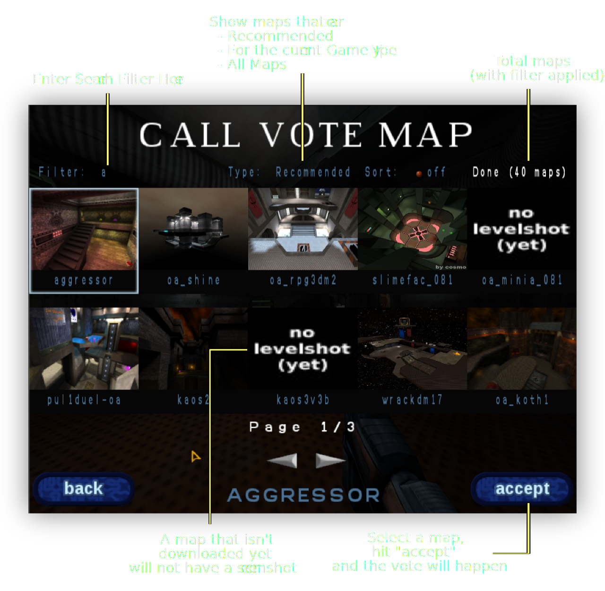
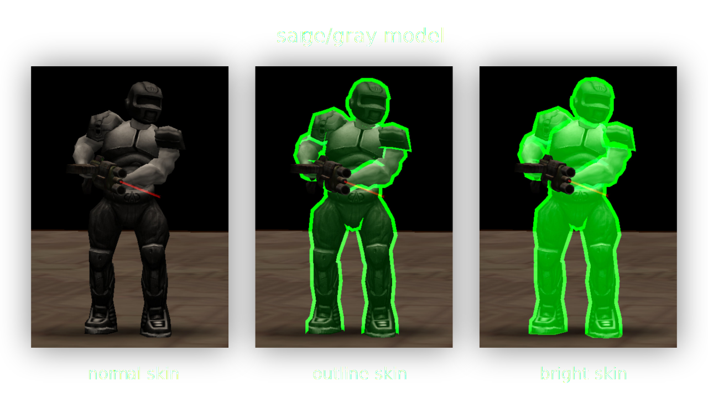
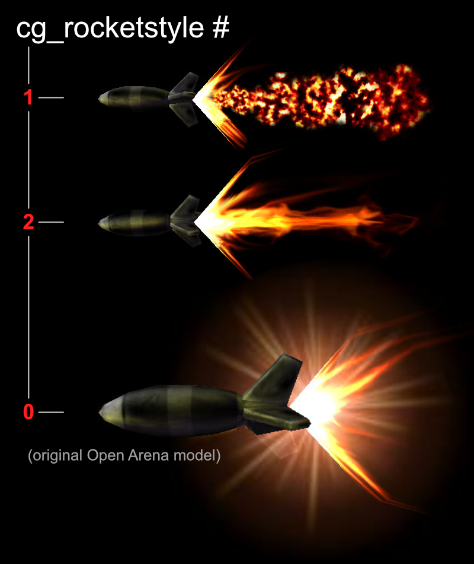

# Config and Command Reference

Ratmod is configured with nice defaults. You may not need to change anything at all.

Not all of the settings listed here are available in the game menu so it is recommended to set up a config file in the ratmod directory. Name it `autoexec.cfg`. This file will be automatically loaded when you are in ratmod. In that file, write one setting per line.

To bind a command to a key or mouse button use `bind`. Write it in your config file with the following format: 

- `bind <some key> <some command>`
- Example: `bind HOME ready`

To set a CVAR setting in your config file, write with the following format:

- `set <cvar name> <setting>`
- Example: `set model sarge`

To use a command directly in the in-game console, it must be preceeded with a slash: `\command` or `/command`.

## Personalization

Be unique. Set your nickname by using `set name "yourname"`. Also set your model with `set model <modelname>`. Use the `body/head` format to set the head differently. Example: `set model beret/sarge`

Personalize your rail color with a hue value from 0-360. Examples:

- `set color1 H240` (rail core)
- `set color2 H140` (rail trail)

## Helpful Binds and Commands

There are several commands that provide utilities or actions for gameplay. 

### Getting Help and Info

#### Display the Message of the Day / Help
- `\motd`
- `\help`

#### Print a link to the documentation
- `\doc`

#### Show the physics rules for the current server
- `\rules`

### Participating in Games

#### A true ninja is always ready:
- `bind HOME ready` - Toggle between "ready" and "unready" state when there is warmup.

#### Commands for Joining Teams or Spectating:
- `\team f` = free for all team or red/blue team depending on balance
- `\team r` = red team
- `\team b` = blue team
- `\team s` = spectator 
- `\team q` = queue (for duel gametype or when the queue system is on)
- `\team n` = notready (queued in duel, but not selected for next game)
- `\team a` = afk (away from keyboard)

#### Spectator commands:
- `\followauto` Automatically cycle spectating through players. It also switches to flag carriers automatically in CTF.
- `\game <1-5>` select which game to watch. This only works for multi-tournament server while you are in spectator mode.

#### Calling for timeout:
- `bind PAUSE pause`
- `bind INS unpause`

### Items and Gameplay

#### Drop the currently held item
- Example: `bind m drop`
- If this is enabled by the server you will drop flags, weapons or ammo.

#### Displaying and Playing Taunts
- `\taunt` will print a list of all taunts
- `\taunt <tauntname>` will play a taunt from the list

#### Pings to mark a Location, Enemy, or Warning
The pings are designed to be a communication tool between team mates. Text-based messages can be difficult to see and read quickly. On the other hand, a visual ping with a sound is quickly understood. This can easily be used in combination with voice communication. The pings will be placed in the spot where your crosshairs are pointed at. There are two binds to use:

##### `bind <key> +ping`
- All of these pings will be shown to your teammates and they will hear a ping sound. If it is out of their field of view, a pointer will show up in their HUD (on the sides) showing them the direction of the ping.
- These pings are meant to draw attention to something, whether it be to "go there", or "enemy is over here" or "the flag is over there" etc. 
- If you point at an empty area (wall or floor), this will show a location ping to your teammates. 
- If you ping in close proximity to an enemy, the icon will change automatically to indicate that an enemy is there.
- If you ping in close proximity to your flag in CTF, a flag ping will be shown to your teammates. If you are carrying the flag and die, using the bind will show your teammates where the dropped flag is.
- Using `+ping` right after you die will also produce a localized X and sound for nearby players.

##### `bind <key> +pingwarn`
- This will show an "X" icon with an error-type sound.
- Unlike `+ping`, this is not global - it is not shown on HUD and the sound will not be heard far away. It is intended for communicating to players close to you.
- Use this to warn your teammates of some danger. It can mean "Don't go there", "Stop", "Caution!" etc.

Here are what the icons look like, but in game they have some visual effects (scale and fade etc):

Check the [Ping Icon Cusomization](#ping-icon-customization) section for customizing the ping settings.

#### Drop token in Treasure Hunt gametype:
- Example: `bind MOUSE5 placeToken`

#### Give up (Tournament gametype only) 
- `\gg`

### Voting

#### Using the map vote menu

- `\mv` will open the menu
- `\mv <filter>` will open the menu with an applied filter.
- Example: `\mv aggressor` will show all the maps containing the string "aggressor"

This is the screen that pops up with `\mv`:

#### List all available votes
- `\callvote`
- `\cv` (short version)
- `\cv custom` list all available custom votes configured by the server

#### Change Arena
- Example `\arena 1`
- This depends on the map. Try number 0-8
- This is only available for Rocket Arena mode with compatible maps.

### CVAR Utilities
#### Reset all ratmod cvars 
- *USE WITH CAUTION, THIS WILL RESET ALL OF YOUR MOD SETTINGS*
- Use `\resetcfg`

#### Show all modified client game cvars
- Those cvars beginning with "cg_"
- `\cgconfig`

## Field of View and Zoom

### Field of View (FOV) Settings
- `set cg_fov <value>` to set your normal FOV. 

### Zoom Settings
- `set cg_zoomfov <value>` to set your zoom fov.
- `set cg_zoomToggle 1` enables +zoom to toggle zoom
- `set cg_zoomAnimScale 2` increases the zoom animation speed (2x normal)
- `set cg_zoomAnim` - set to 0 to turn off zoom animation.
- `set cg_zoomfovTmp` - utility for scripting zoom fov. [needs more]
- `set cg_specShowZoom 1` enables ability to see when players are zooming while you are spectating.

### Zoom Scopes

Ratmod has a zoomscope available for machine gun and rail gun. To enable them use `set cg_drawZoomScope 1`. 

There are a few settings available to alter the appearance of the scopes:

- `set cg_zoomScopeSize` will change the size (try 0.8 for smaller)
- change the color for each using HSV. Example: `set cg_zoomScopeMGColor "H60 1.0 0.5"` and `set cg_zoomScopeRGColor "H120 1.0 0.5"`

By default the colors are green for the rail scope and yellow for the machine gun scope.

*Note: By default OA uses a zoom animation and the zoom scope will appear when that animation has finished - fully zoomed in. If you would like your zoom to be at full zoom instantly and also the scope to appear instantly set `cg_zoomanim 0`*

## Forcing Models and Brightskins

There are several options available to force models and colors for models.

### Forcing Models

Sarge and smarine each have a "gray" skin for brightshell and brightoutline overlays:

- `set cg_teamModel sarge/gray` for your team
- `set cg_enemyModel smarine/gray` for the enemy

Alternatively, the "bright" skins are available for better performance (but don't look as good).

- `set cg_teamModel sarge/bright` 
- `set cg_enemyModel smarine/bright` 

Set `cg_forceModel` to `1` to visually force other players have the same model as yours (for non-team based modes). *This is usually used for performance.*

If you wish to see your team mate's own models, you must set `cg_teamModel` to an empty value (`""`).

### Bright Shells/Outlines

!!! Info "Caution:"
    If you enable everything (which is the default) then the "brightest" version of skins that the server allows will be used. If the server allows outlines and shells, you will see shells (unless you disable them). **For most players there is no reason to change any of these settings.**

    Brightmodel or brightshells have to be allowed by the server for this to work. On servers set up for casual play, these settings will not have any effect.*

    - `set cg_brightShells 1` enables bright shells
    - `set cg_brightShells 2` is an alternative bright shell style.
    - `cg_brightShellAlpha` controls the transparency of the bright shells (use for example 0.8)
    - use `set cg_brightOutline 1` for bright player outlines. To use this `cg_brightShells` must be `0`. Some players may like this more for casual games.

### Forcing Colors

!!! Info "Note"
    Forcing colors only works when the server configuration allows it. These colors apply when `cg_teamModel` or `cg_enemyModel` are set to a bright model (smarine/bright or sarge/bright) or when brightshells are enabled.

There are three ways to specify a color:

- **Color names**: "red", "orange", "yellow", "green", "cyan", "blue", "pink" and "white". 
- **Color numbers** from 1-8 (corresponding to the above).
- **HSV format** for precise colors. Example `"H125 1.0 1.0"` for green. Hue can be between 0 and 360, saturation/value from 0.0 to 1.0.

If you want your team and enemy colors to always be the same, you can force them:

- `set cg_enemyColor "green"` will make the enemy green.
- `set cg_teamColor "orange"` will make your team orange.

Note: if you do not force your team color, then default team hues are used. This is useful for example if you want to have your team color red when on the red team. Blue when on the blue team. The following defaults are use when `cg_teamColor` is set to `""` (no value).

- `set cg_teamHueRed 0`
- `set cg_teamHueDefault 125`
- `set cg_teamHueBlue 210`

The following will, if set, override `cg_enemyColor`/`cg_teamColor` for the respective body parts:

- `set cg_enemyLegsColor ""`
- `set cg_teamLegsColor ""`
- `set cg_enemyTorsoColor "white"`
- `set cg_teamTorsoColor ""`

#### Head Colors
Automatically assign distinct head color (per team) by setting:

- `set cg_enemyHeadColorAuto 1`
- `set cg_teamHeadColorAuto 1`

If the above values are set to `0` you can force the head colors: 

- `set cg_enemyHeadColor "yellow"`
- `set cg_teamHeadColor "orange"`

#### Appearance of Corpses
Darken corpses with:  

- `set cg_enemyCorpseValue 0.25`
- `set cg_teamCorpseValue 0.25`

Desaturate corpses:

- `set cg_enemyCorpseSaturation 0.75`
- `set cg_teamCorpseSaturation 0.75`

## Sounds

!!! Info "Note"
    Forcing sounds is only allowed if forcing bright models is allowed by the server. On servers set up for casual play, these settings will not have any effect.

### Player Sounds
It is possible to force player sounds. This is helpful to distinguish who is who when you don't have a visual. Here are examples:

- `set cg_mySound sarge` - your sounds will be sarge
- `set cg_teamSound beret` - team sounds will be beret
- `set cg_enemySound tony` - enemy sounds will be tony

### Player Footsteps

You may also force the footstep sounds. There are several options:

- `-1` = default, based on player's model
- `0` = normal footsteps
- `1` = boot footsteps
- `2` = flesh bootsteps (merman)
- `3` = mech bootsteps (smarine)
- `5` = energy bootsteps (ayumi)

Examples for forcing footsteps:

- `set cg_myFootsteps 1` (yours)
- `set cg_teamFootsteps 3` (team sounds)
- `set cg_enemyFootsteps 2` (enemy sounds)

### Announcer

Ratmod has a new set of vocal announcements. You can switch back to the original OA announcements if you prefer with `set cg_announcer ""`. 

Use treb's voice with `set cg_announcer "treb"` and if you only want treb's voice for the new awards use `set cg_announcer ""` and `set cg_announcerNewAwards "treb"`.

### Other Sound Settings
- `set cg_teamChatBeep 1` - Toggle the chat beeps from your team. These are from any team you are on (red, blue, or spectator)
- `set cg_chatBeep 1` - Toggle chat beep sounds on or off
- `set cg_music 0` - Toggle music on or off
- `set cg_hitsound 1`- Toggle wether or not hit sounds are played when you hit an enemy with your weapon. 

## HUD

### Status Bar
The status bar shows your health, ammo, and armor amounts among other things. Use `cg_ratStatusbar` with these different values: 

- `0` = old-school OA statusbar
- `1` = flag on the left
- `2` = flag on right
- `3` = minimalistic version
- `4` = futuristic statusbar with health/armor bars in the center, ammo bar on the left. Also enables new powerup display
- `5` = similar to 4, but vertically flipped

`cg_drawHabarBackground 1` - gives a background for the health/armor bar in the futuristic HUD.

### Weapon Bar
The weapon bar will show you which weapons you have, which weapon is selected, and depending on the weapon bar style, how much ammo you have.

Use `set cg_alwaysWeaponBar 1` to always show the weapon bar. If you want to change the style try `set cg_weaponBarStyle 13` or `14` for a horizontal weapon bar. `12` for vertical. There are 16 different styles in total.

### Awards Display
`set cg_drawRewards 1` will show the awards you get immediately, with different awards appearing side-by-side. The announcements will be played in rapid succession. Set this to `2` to use the old OA way of showing awards slowly one after another. Set it to `0` to disable showing awards.

### Low or Empty Ammo Indicator
- `set cg_drawAmmoWarning 1` will show you a low ammo warning
- use `set cg_emptyIndicator 1` to show a box around the crosshairs when the selected weapon is out of ammo

### Damage Taken Indicator
There are some different options to show when you are receiving damage and what direction it is coming from:

- `set cg_hudDamageIndicator 1` shows the damage indicator on the sides of the screen when getting hit
- `set cg_hudDamageIndicator 2` shows a damage indicator around crosshair
- `set cg_hudDamageIndicator 3` is the old OA damage indicator (blood splatter)
- You can make some adjustments to the damage indicator with these cvars: 
- `cg_hudDamageIndicatorScale` - change the scale (0.0-1.0)
- `cg_hudDamageIndicatorAlpha` Change the transparency (0.0-1.0)
- `cg_hudDamageIndicatorOffset` - change the offset from centre

### Crosshairs
A variety of crosshairs have been added for the sake of variety but also to address some clarity issues. Another point was to provide some varying sizes of similar crosshairs. (There is an in-game mechanism to adjust the crosshair size but that unfortunately does not always result in a crisp crosshair.)

#### One crosshair for all weapons
If you just want to use one crosshair, you can set it with the UI menu or you have two cvars to play with: `cg_drawcrosshair [num]` and `cg_crosshairsize [num]`.

#### Configure crosshair for each weapon
You must first use `set cg_differentCrosshairs 1` and then customize each crosshair with the following:

- `set cg_ch1 [num]` - gaunt
- `set cg_ch2 [num]` - machine gun
- `set cg_ch3 [num]` - shotgun
- `set cg_ch4 [num]` - grenade launcher
- `set cg_ch5 [num]` - rocket launcher
- `set cg_ch6 [num]` - lightning gun
- `set cg_ch7 [num]` - rail gun
- `set cg_ch8 [num]` - plasma gun
- `set cg_ch9 [num]` - bfg
- `set cg_ch10 [num]` - grapple
- `set cg_ch11 [num]` - nail gun
- `set cg_ch12 [num]` - proximity mine
- `set cg_ch13 [num]` - chain gun

*Note: The default size for each crosshair is `30`. If you want to adjust that, append `size` to the cvars listed above. Example: `set cg_ch2size 35`.*

*Note: Clarity and sharpness of crosshairs seems to be affected by texture quality settings. Low settings will result in crosshairs that aren't sharp. It's recommended to use high quality texture settings.*

*Note: Original Open Arena crosshairs are not available now in ratmod.*

#### Crosshair Health Indicator

- `set cg_crosshairhealth 1` - When enabled the crosshairs will change color depending on your health. Custom crosshair colors are disabled if this is on. `2` is a variant. Use `0` for no change in color (and also to allow custom colors)

#### Crosshair Color
Set the color with these (*Note: requires `set cg_crosshairhealth` to be `0`.*):

- `set cg_crosshairColorRed 1.0`
- `set cg_crosshairColorGreen 1.0`
- `set cg_crosshairColorBlue 1.0`

#### Crosshair Hit Indicator
This feature will change the color of your crosshair if you hit another player. 

- `set cg_crosshairHit 1` to enable the feature
- `set cg_crosshairHitColor "H300 1.0 1.0"` - this is the color it will be when you hit with maximum damage (HSV color format). You can also specify a color by name ("red").
- Different styles are available:
    - `set cg_crosshairHitStyle 1` - indicates the damage via the difference between the normal crosshair color and the hit color 
    - `set cg_crosshairHitStyle 2` - varies the hue of the hit color based on the damage (positive direction)
    - `set cg_crosshairHitStyle 3` - varies the hue of the hit color based on the damage (negative direction)

### Game Information

#### Game Timer

The timer is important and shows you the time since the match started:

- `set cg_drawTimer 1` - enables the timer (it is off by default).
- `set cg_timerPosition 0` - places the timer on the top right
- `set cg_timerPosition 1` - places the timer in the top middle
- `set cg_timerScale <value>` - use this to change the size of the timer (1.2 will be bigger)
- `set cg_timerAlpha <value>` - can be used to change the transparency (0.0-1.0) 

#### Movement Speed
- `set cg_drawSpeed 1` - will show you how fast you are moving
- `cg_speedScale` - change the size
- `cg_speedAlpha` - change the transparency

#### Frames Per Second (FPS)
It is not covered here, but it is very important to adjust certain settings in order to have a constant FPS. You can see your FPS with this:

- `set cg_drawFPS 1` - top right corner
- `set cg_drawFPS 2` - will be printed over the lagometer
- `set cg_drawFPS 3` - printed to the left of the lagometer
- `cg_fpsScale` - change the size
- `cg_fpsAlpha` - change the transparency

#### Item Pickup Feedback
- `set cg_drawPickup 1` - will show what item you picked up on the top right
- `set cg_drawPickup 2` - will show it on the bottom left
- `set cg_crosshairPulse 1` - the crosshair will pulse when you pick up an item
- `cg_pickupScale` - change scale of the item pick up indicator

### Team / CTF Settings
- `set cg_drawFriend 1` - draws arrows over your teammates (can see them through walls). This is useful for seeing your teammates status from a distance without needing to read any numbers. The location arrows change color depending on health amount.
- `set cg_friendFloatHealth 1` - *deprecated* shows health above friends heads if friend indicators through walls is not on.
- `set cg_friendFloatHealthSize 10` - *deprecated* change the size for the above

#### Team Overlay
The team overlay displays stack, location, and weapon information about your team mates.

- `set cg_drawTeamOverlay 4` - displays a table of your team mates (4 is the bottom right). 
- `cg_teamOverlayScale` - change the scale of the team overlay

#### Ping Icon Customization
- `cg_pingLocationBeep` - toggle the sound for the pings
- `cg_pingLocationHudSize` - change the size of the pings on your HUD
- `cg_pingLocationHud` - toggle to show the pings on your HUD
- `cg_pingLocation` - change the ping location icon (1-3)
- `cg_pingLocationSize2` - change the size of the inner icon
- `cg_pingLocationSize` - change the size of the outer icon
- `cg_pingLocationTime2` - change the amount of time the inner icon is displayed for
- `cg_pingLocationTime` - change the amount of time the outer icon is displayed for
- `cg_pingEnemyStyle` - change the enemy ping icon style (1-3)

#### Radar Position (for CTF)
- `set cg_radar 1` will draw a radar with the position of the flag carrier at the top. Use `2` for the bottom right.

### Player Names/Health in Crosshairs
- `set cg_drawCrosshairNames 1` - the name of the player in your crosshairs will be printed below the crosshairs
- `set cg_crossHairNamesHealth 1` - show the health/armor amounts of your team mate under their name.
- `set cg_crossHairNamesY 280` - adjust the vertical height

### Reload Indicator
This shows the weapon reload time in a bar on the HUD.
- `set cg_reloadIndicator 1` - enable the reload indicator (off by default)
- `cg_reloadIndicatorAlpha` - change the transparency
- `cg_reloadIndicatorHeight` - change the bar height
- `cg_reloadIndicatorWidth` - change the bar width
- `cg_reloadIndicatorY` - change the vertical location on the HUD

### Scoreboard
- `cg_ratScoreboardAccuracy` - toggles showing accuracy on the scoreboard.
- `cg_ratScoreboard` - toggle using the ratmod scoreboard

### Other HUD Information
- `set cg_drawAttacker 1` - shows who is hitting you in the top right (name and avatar). Change the scale with `cg_attackerScale`
- `set cg_lagometer 1` - will draw the lagometer (network graph) on the bottom right 

### Further Customization for HUD Information
- `cg_drawStatus` - `0` to disable the HUD
- `cg_draw2D` - `0` will disable the HUD and scoreboard.
- `cg_draw3dIcons` - `0` will make HUD items 2D. By default it is `1`
- `cg_drawIcons` - Toggle the drawing of any icons (weapon, model head) on the HUD and scoreboard.
- `cg_drawTeamBackground` - toggle for the team red/blue background color on the scoreboard.
- `cg_drawFollowPosition` - `1` shows the name of the person you are spectating in the top right. `0` for top centre.
- `cg_fragmsgsize` - change the size of the message that shows you fragged a player

## Visuals

### Simple Items
- `set cg_simpleItems 1` - Use 2D icons for map items instead of 3D models. Turning this setting on can help with video performance. Ratmod has custom made 2D icons for the game and they are more visible than the 3D models.

### Lightning Gun Style
- `set cg_ratLg 3` - straight LG beam
- `set cg_ratLgImpact 0` - removes the LG impact crackle. 

### Rocket Style
There are different visual styles of rockets available. Set it with `cg_rocketstyle`.

- `set cg_rocketStyle 1` - smaller rocket, flame style 1
- `set cg_rocketStyle 2` - smaller rocket, flame style 2
- `set cg_rocketStyle 0` - default OA rocket

### Rail Style
- `set cg_ratRail` - rail style 1-3
- `set cg_ratRailRadius 0` - disable the rail spiral
- `set cg_ratRailBeefy 1` - rail with heft

### Projectile Trails
- `set cg_noprojectiletrails 0` - enable projectile trails

#### Rocket Smoke Trail Settings
- `set cg_ratRocketTrail 1` - enabled (default)
- `set cg_ratRocketTrailRadius 1` - changes the radius
- `set cg_ratRocketTrailAlpha 0.2` - changes how visible the smoke is
- `cg_ratRocketTrailTime` - how much time the trail is displayed
- `cg_ratRocketTrailStep` - will affect how much smoke

#### Plasma Trail Configuration
- `set cg_ratPlasmaTrail 1` - enabled (default)
- `set cg_ratPlasmaTrailAlpha 0.1` - change how visible the trail is
- `set cg_ratPlasmaTrailTime 500` - how much time the trail is displayed
- `set cg_ratPlasmaTrailStep` - how much trail there is

### Quad Damage Holder
- `set cg_quadStyle 0` - normal quad damage
- `set cg_quadStyle 1` - color-changing quad damage
- `cg_quadHue` - change the shell color for quad damage
- `cg_quadAlpha` - change the transparancy for the quad damage shell
- `cg_quadStyle` - set a different style for the shell

### Other
- `set cg_drawSpawnpoints 1` - show spawnpoints during warmup
- `set cg_oldMachinegun 1` - use the old machinegun model

## Console/Chat

- `set cg_newConsole 1` - set this to `0` if you want to have the console messages printed by ioq3 again.
- `set cg_newFont 1` - set to `0` for old font
- `set cg_fontShadow 1` - drop shadow behind console/chat text to increase readability
- `set cg_fontScale 1.1` - anything greater than 1.0 increases console/chat font sizes

## Advanced

`set cg_projectileNudgeAuto 1` - this will automatically set projectilenudge based on your ping. This helps to dodge rockets as the behavior is the same regardless of ping. If it is set to `0`, the rockets might lag behind, with the result being that you might avoid touching a rocket and still get hit. 

## Cheat Protected CVARS
*The following are cheat protected: cg_itemFadeTime, cg_cameraOrbit, cg_crosshairHitTime, cg_thirdPersonAngle, cg_thirdPersonRange, cg_tracerlength, cg_tracerwidth, cg_tracerchance, cg_footsteps, cg_noplayeranims, cg_debugevents, cg_debugposition, cg_debuganim, cg_animspeed, cg_centertime, cg_gunZ, cg_gunY, cg_gunX, cg_bobup, cg_swingSpeed*

