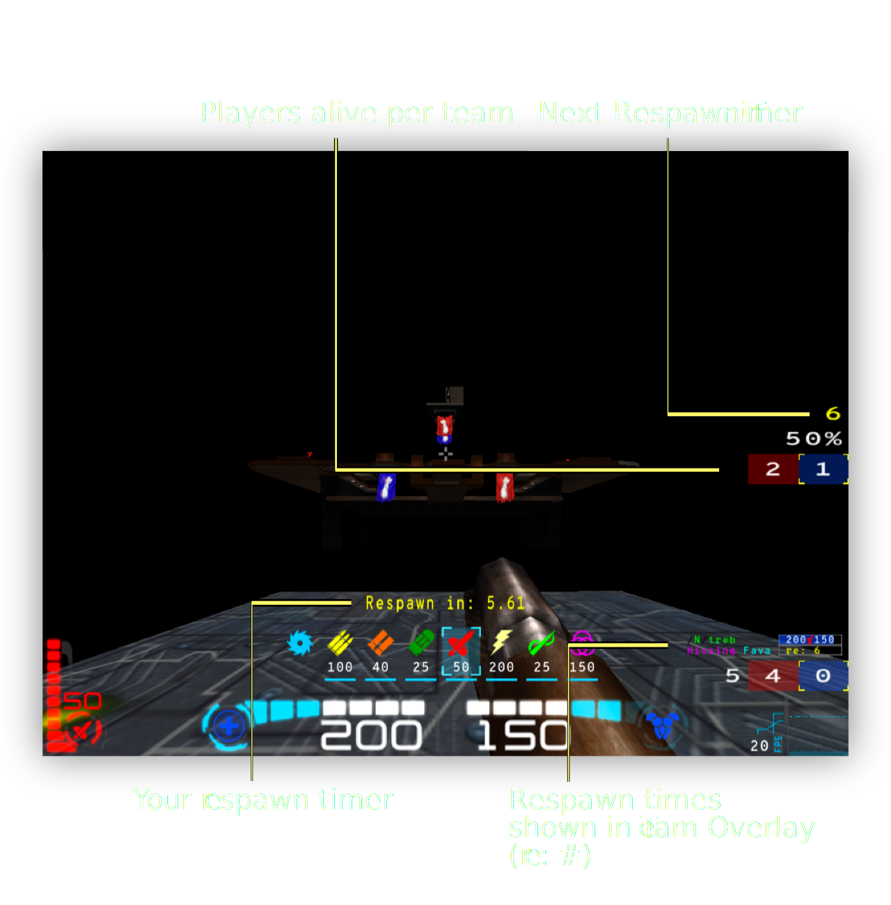
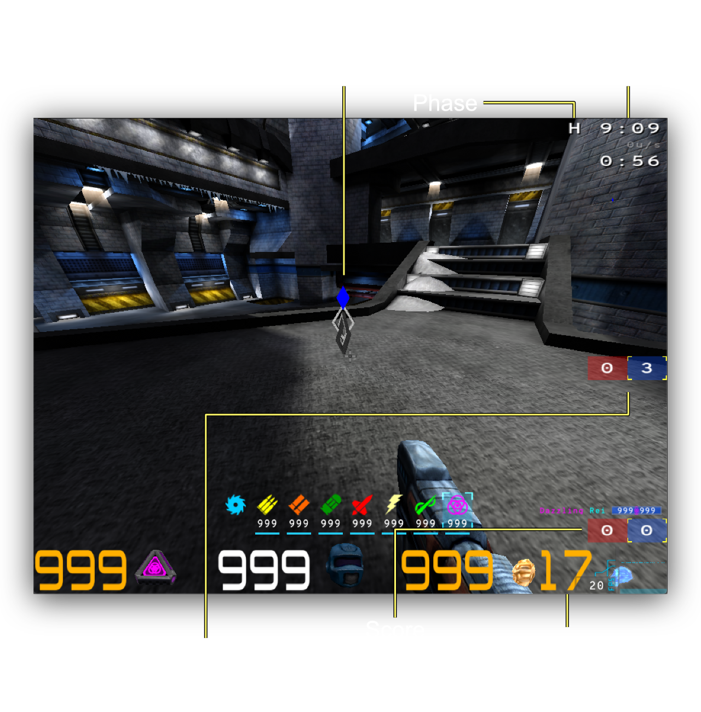

# Custom Game Types

Ratmod has several custom game types which will be explained here.

## Extermination (XTERM)
Xterm (Extermination) is a spin-off of Clan Arena (CA/Elimination) and inspired by "Wipeout" from Diabotical. Some of the game mechanics are the same as CA, but some are different. There are two teams and players spawn with all weapons and a full health and armor stack. A round will finish when all players of one team are dead. When a team reaches the maximum points (5 by default), they win. 

When a player dies in Xterm they will respawn. Each team has their own respawn delay and the initial delay is 5 seconds. Every time a player dies that delay for that team increases by 5 seconds. The respawn timer for your own team is shown on the right side of the screen and also in the team overlay for each player. When someone respawns there is a sound played. The growing delay between spawns is what can often give one team an advantage over the other. When there is one player left on either team, the game will give an announcement. 

This game is a spin-off of CA but ideally shouldn't be played in the same way. Different strategies and communication are required to win. 

When choosing maps for Xterm consider that if the map is too big or too small it is likely not ideal for this mode. 

If this game type is available on a server, you can change to it by voting `\cv custom xterm`

## Treasure Hunter (TH)

This is a team game of hide and seek with tokens. At the beginning of a match there is a **Hiding Phase** during which each player on each team has tokens to hide around the map. After the time runs out for the hiding phase, the **Seeking Phase** begins. The team that finds the other teams tokens first will win. Or the team that has the most tokens after the time runs out. 

There is quite a lot of time given for both phases, but it can be quite a challenge to find some tokens. This mode has the map clipping turned off so you are able to go in many strange places not normally allowed (for example underneath maps etc). Players often utilize rocket jumps and etc in order to get to difficult places on maps. 

A few special things to remember:

- To place a token you need to use the command `\placetoken`. Bind it to a key: `\bind <key> placetoken` 
- Tokens cannot be hidden in places where you normally die (in lava etc). 
- If you are not happy with your token placement during the hiding phase, you can destroy it by shooting it and try again
- When you discover a token during the seeking phase, to "catch" it you can touch it with your player model *or* you can shoot it. Tokens have a good deal of health so it is faster to touch it. 
- The location of your teams tokens is shown with a diamond icon that can be seen from anywhere.
- You cannot see the other team players but you can hear them.

Vote for this game type if it available with `\cv custom th`

## FFA with All Weapons (FFA_AW)

This is a cross between Clan Arena and Free For All (Deathmatch). Players spawn with all weapons and a full stack of health and armor. There are no items on the map. In order to win you need to reach the frag limit *or* have the most points when the timer is up. 

Vote for this game type if it available with `\cv custom ffa_aw`

## Duel with Equalized Ping (dueleq)

To be fair with pings use this mode for duel. 

Vote for this game type if it available with `\cv custom dueleq`
