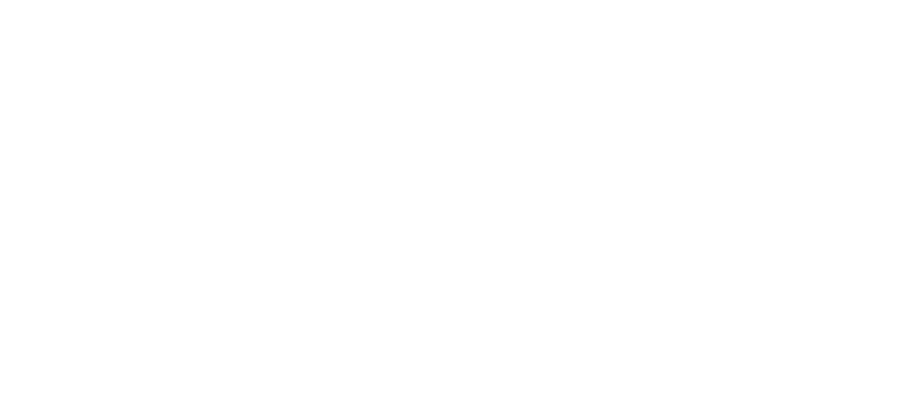

# Ratmod - by the rats, for the rats

This is documentation for ratmod - an open source mod for [Open Arena (OA)](http://www.openarena.ws) which is a Quake 3 Arena clone. 

You can find the source code for the mod [hosted on github.com](https://github.com/rdntcntrl/ratoa_gamecode).

Navigate to different pages using the navigation links.

## Getting Started with Ratmod

Ratmod is all set up for you with great defaults. Make sure that auto-download is on and when you go on a Ratmod server everything will be set for you. 

To make an enemy model green and team model pink:

- `\cg_enemyColor green`
- `\cg_teamColor pink`

If you want the default team colors back, use a blank value: `""`

Some people ask: [Why don't brightskins/shells/outlines show up even though I configured them?](faq.md#why-dont-brightskinsshellsoutlines-show-up-even-though-i-configured-them)

To see an overview of the available votes, type `\cv` in the game console.

To see custom votes available, type `\cv custom` in the game console. You can also use the vote menu (Esc -> Call Vote -> Custom Vote)

If you're new to ratmod, please check out the [Helpful Binds and Commands](config-command-reference.md#helpful-binds-and-commands).

For further customization, check out the [Config and Command Reference](config-command-reference.md).

## The Team Queue System

There is now a queue system available for team-based modes. The intention of this system is to make sure the teams have equal numbers. It only allows people to join in pairs, which ensures that joining players cannot create unequal teams.

This is not yet on by default *yet* and it is a vote: `\cv custom queues`

- All people waiting in queue will be shown on the scoreboard with appropriately colored text.
- when a player for each team is available in the queue, they will join the game.
- If the teams become unequal because one or more of the players leave, then the server will equalize the player numbers. This will happen after a round is finished for round-based game types. The last player that joined a team is put in queue in this situation.

