# Medal Reference

Stock medal icons have been redesigned, and a good number of medals have been added. Many of these are designed to reward *good* skill and if you achieve something during play it will show up in your HUD with an announcement.

At the end of a match, it is possible to see the medals that all players received by pressing `TAB` while viewing the scoreboard.

Medal Icon | Description
---------- | -----------
 | **Impressive** Hit two rails in a row.
 | **Humiliation** Frag an opponent with Gauntlet
 | **Excellent** Frag two opponents within a short period of time.
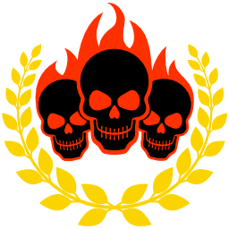 | **Frags** Frag three opponents within a short period of time.
 | **Accuracy** Hit an opponent multiple times with the same weapon with perfect accuracy.
 | **Aimbot** Turn very quickly and hit an opponent with rail gun.
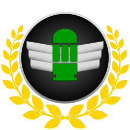 | **Air-Nade** Hit an opponent with a grenade while they are in the air.
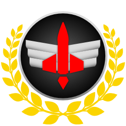 | **Air-Rocket** Hit an opponent with a rocket while they are in the air.
 | **Ambush** Frag an opponent who just spawned or just came through a portal.
 | **Berserker** Get 3 gaunt kills in a row without dying.
 | **Point Blank** Shoot an opponent at point blank range with the shotgun so that all pellets hit.
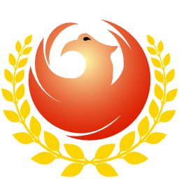 | **Immortal** Receive 800 damage while staying alive. 
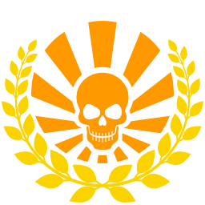 | **Kamikaze** Frag an enemy while taking your own life.
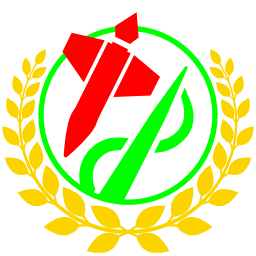 | **Combo Kill (Rocket > Rail)** Make an opponent fly into the air with a rocket, then frag them with a rail.
 | **Combo Kill (Lightning > Rail)** Frag an opponent by dealing lightning damage first and finishing off with a rail shot.
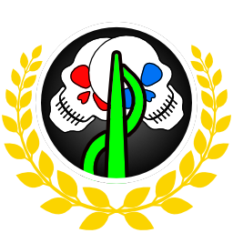 | **Rail Master** Shoot through two opponents with railgun to receive one. For each additional opponent you hit, you get another medal.
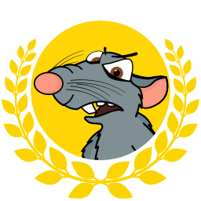 | **Rat** Awarded for rat-like behavior.
 | **Dead Hand** Fragging an enemy with a projectile you fired prior to dying.
 | **Rocket Sniper** Directly hit an opponent far away with a rocket.
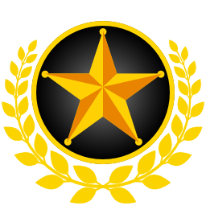 | **Hero** In CTF, awarded for getting the flag out of the enemy base, returning your own flag and capturing without any of your teammates touching any flags.
 | **Show Stopper** Frag someone who has a powerup.
 | **Strongman** Frag all of the enemy team on your own. In FFA no one else can get a frag in between your spree.
 | **Telefrag** Teleport into another players personal space and kill them.
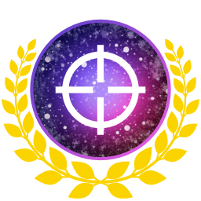 | **Interdimensional** Frag an opponent through the teleporter with any projectile.
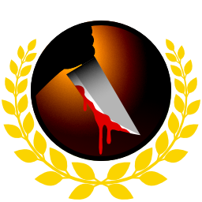 | **Revenge** Awarded for fragging the opponent that killed you quickly after you respawn.
 | **Butcher** Awarded for gibbing 10 corpses using the gauntlet.
 | **Vaporized** Frag an opponent by doing more than 100 plasma damage within 800ms.
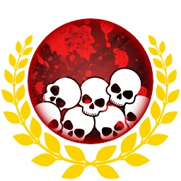 | **Killing Spree** Awarded for a killing spree of 5.
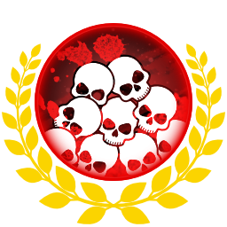 | **Rampage** Awarded for a killing spree of 10.
 | **Massacre** Awarded for a killing spree of 15.
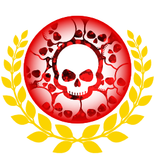 | **Unstoppable** Awarded for a killing spree of 20.
 | **Grim Reaper** Awarded for killing sprees of 25 as well as every 5 frags after that.
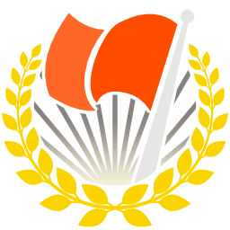 | **Victory** In CTF, this is displayed when you capture the flag.
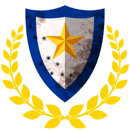 | **Defense** In CTF, frag an opponent who is either in your base or close to your flag carrier.
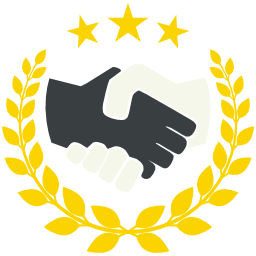 | **Assist** In CTF, return your flag so a team mate can score.

